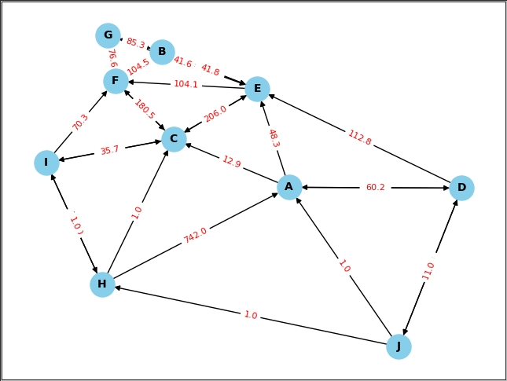
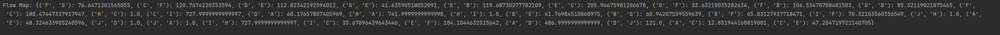

# 代码功能
- 生成随机节点，计算节点间的欧几里得距离
- 实现 Dijkstra 算法，计算最短路径
- 生成随机速度，计算成本
- 多次迭代优化路径之间流量
- 可视化展示

# 项目描述
- 使用 random.uniform(0, 100) 为每个节点生成坐标,获取每个节点到其他节点的距离。用于确定最近邻节点距离。
- 实现 Dijkstra 算法，用于计算从 origin 到 destination 的最短路径。
- 对于每条边 (node, neighbor)，计算节点间的欧几里得距离，并生成随机速度。
- 多次迭代优化路径之间流量，使得流量分布更平均且成本更低。
- 控制台输出成本，基于长度、速度和流量，计算公式为 length / speed + 0.1 * flow，即考虑速度与流量的影响。

# 效果预览

# 小组成员及贡献
- 陈祉澎  2022091201006，负责代码实现，文档编写
